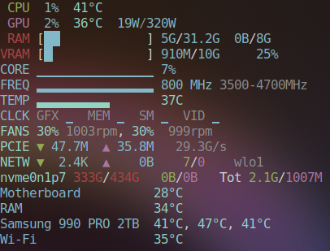

htop alternative for GPU/CPU and all other hardware info




### Features
- Live CPU/GPU/VRAM/RAM/PCIe/Fans/Power/Network/Drive/Temp/Clock
- Compact Printing and Color Coding
- Core Usage/Freq/Temp Bar Graph
- RAM/VRAM Bar
- Graphics/Mem/StreamingMultiprocessor/Video Clock Bar
- Hardware Info and Model Names

### How To Use
``` bash
hwtop       # hardware sensors
hwtop info  # hardware info
hwtop extra # extra components and their temperatures
hwtop plain # no ANSI colors
```